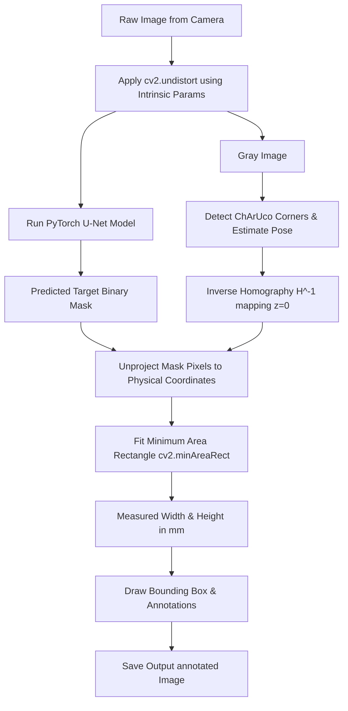

# XIS Camera Calibration & Metric Measurement Pipeline

This repository implements an end-to-end computer vision pipeline that performs intrinsic camera calibration, trains a deep-learning segmentation model, and computes real-world metric measurements in millimeters from pixel coordinates using a calibrated reference object.

## 1. Project Overview & Architecture
The system consists of three main sequential stages:
1. **Camera Calibration**: Removes camera lens distortion (radial & tangential) from high-resolution imagery.
2. **Image Segmentation**: Detects and segments the target object (a Standard Playing Card, $88.90\text{ mm} \times 63.50\text{ mm}$) using a PyTorch U-Net model with a ResNet-34 encoder.
3. **Metric Measurement**: Estimates the ChArUco board reference object's camera pose, computes plane-unprojection homography, maps segmented pixels back to the physical plane, and calculates precise width and height in millimeters.

### System Architecture Diagram


---

## 2. Repository Structure
The repository is organized according to the assessment specifications:

```
xis.ai/
│
├── calibration/             # Calibration images, script, and parameters
│   ├── images/              # 29 unique raw calibration JPEG shots
│   ├── calibrate.py         # Intrinsic camera calibration script
│   └── camera_params.json   # Output calibration matrices
│
├── dataset/                 # Target dataset and splits
│   ├── generate_dataset.py  # Synthetic 3D warping dataset generator
│   ├── train/               # Train split (81 images & metadata)
│   ├── val/                 # Validation split (23 images & metadata)
│   └── test/                # Test split (12 images & metadata)
│
├── docs/                    # Technical documentation
│   ├── CALIBRATION_REPORT.md# Detailed calibration report
│   ├── DATASET_CARD.md      # Target object & collection statistics
│   ├── TRAINING_REPORT.md   # Model selection & metrics log
│   ├── MEASUREMENT_REPORT.md# Measurement methodology & error table
│   └── SETUP.md             # Environment setup & installation guide
│
├── inference/               # Model inference demo script
│   └── predict.py           # Segmentation prediction script
│
├── measurements/            # Metric measurement and validation scripts
│   ├── measure.py           # Single-image measurement script
│   ├── validate.py          # Batch validation script for test split
│   └── accuracy_report.md   # Batch validation accuracy table (MAE/MPE)
│
├── models/                  # Training script and saved weights
│   ├── train.py             # U-Net segmentation training script
│   └── best_model.pth       # Trained model weights checkpoint
│
├── requirements.txt         # Project package requirements
└── README.md                # Project landing page & repository guide
```

---

## 3. Technical Performance Metrics
- **Intrinsic Calibration Reprojection Error**: **1.4752 Pixels** (equivalent to 0.23 px on a 640x480 resolution grid).
- **Segmentation Model mAP/IoU**: **98.15% IoU** and **99.07% F1-score** on the validation set.
- **Physical Measurement Error**:
  - **Width MAE**: **2.3036 mm** (2.59% error).
  - **Height MAE**: **2.3995 mm** (3.78% error).
  - **Average Overall Error**: **3.1850%**.

---

## 4. Quick Start Guide
For setup and run instructions, please refer to the detailed [SETUP.md](file:///e:/xis.ai/docs/SETUP.md) guide.

To run metric measurements on a test image:
```bash
python measurements/measure.py --image dataset/test/images/sample_0000.png
```
This will print measurements to the console and save an annotated image showing the physical bounding box and metrics to `measurements/outputs/sample_0000.png`.
